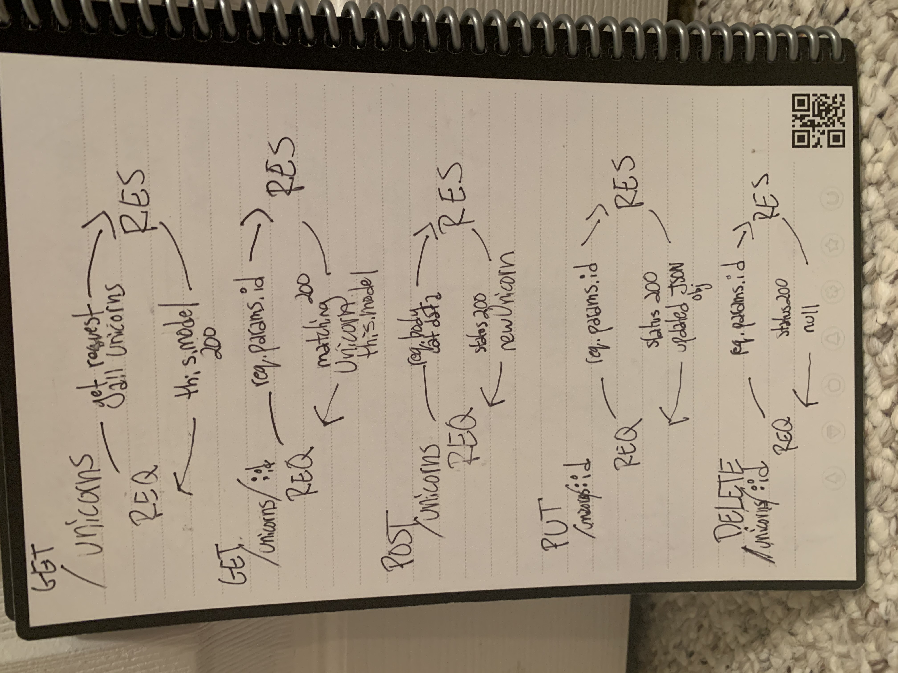

# LAB 3

## Project: API Server

### Author: Sara Strasner

### Links and Resources

- [Latest PR](https://github.com/sarastrasner/api-server/pull/2)
- [ci/cd](https://github.com/sarastrasner/api-server/actions)
- [front-end application](https://sarastrasner-api-server.herokuapp.com/unicorns) 

### Setup

#### `.env` requirements (where applicable)

- `PORT` - 3000

#### How to initialize/run your application (where applicable)

- e.g. `npm start`

#### Tests

- The tests all run via jest in the terminal.
- All tests are passing locally.
- 

#### UML
